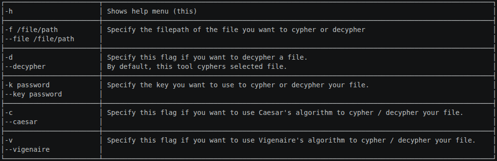

    

# fileEncryptor
fileEncryptor is a tool to cypher and decypher a file using a variety of encryption algorithm

It is a personal project developed out of curiosity about cryptography and will to discover how encryption algorithms work.

> [!CAUTION]
> Disclaimer : This tool is a personnal project made for educationnal purposes.
> Every algorithm present in this code is an interpretation of the commonly known algorithm with which it shares its name; thus, it does not meet any safety standards and must not be used to secure sensitive information.

## Supported encryption algorithms
This tool supports the following encryption algorithms :
- Ceasar
- Vigenere
- (to be implemented)

## Features
- __Encryption__ : fileEncryptor can encrypt a selected file with given algorithm and key.
- __Decryption__ : The same way it can encrypt a file, it can decrypt it with the flag `-d`
- __Logs__ (to be implemented) : As this tool is made for educationnal purposes, every encryption and decryption are logged into a file, with the path of the file treated and the algorithm and key used.

## How to use
After compiling this project with a C compiler and giving the executable file execute permission with `chmod +x fileEncryptor`, 
you can execute it with this command : `./fileEncryptor -f /file/path -k password -v [-d]`

The following table describes every flag currently available :

    

## Project architecture
